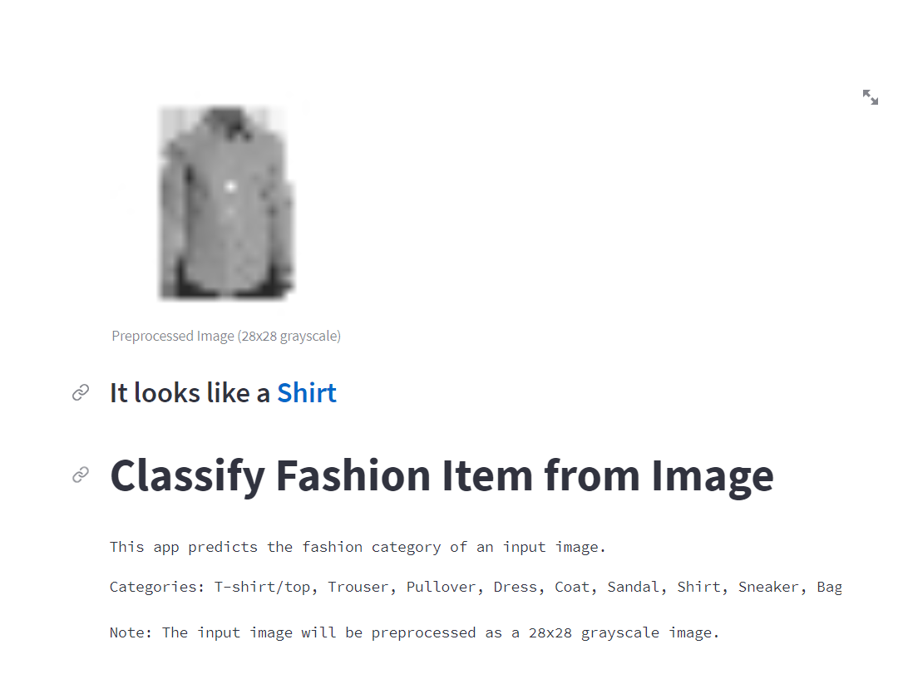

# Fashion Item Classification App
This Python project is a simple web application built using Streamlit that allows you to classify fashion items based on input images. The app uses a pre-trained TensorFlow model to perform the classification. 
#### The project is available
 [Fashion Item Classification App](https://awesomemimiprojectdl2.streamlit.app/)


Here's how the app works:

## Installation
1. Create virtual environment (it needs for library consistency). 
```sh
python -m venv venv
```
2. Activate virtual environment
```sh
source venv/Scripts/activate 
```
3. To run this project, you need to have the following dependencies installed:
- streamlit
- tensorflow
- numpy

You can install the dependencies by running the following command:
```sh
pip install -r requirements.txt
```

## Usage
To use the Fashion Item Classification App, follow these steps:
1. Run the Python script or execute the code in a Python environment.
```sh
streamlit run group3_classify_fashion_image.py 
```
2. The app will launch in your web browser.
3. The app provides a brief description of its functionality and the categories it can classify.
4. Upload an image by clicking on the "Upload an image" button and selecting an image file (PNG, JPEG, or JPG). You can use eimage example in images foler
5. Click the "Classify" button to perform the classification.
6. The app will display the preprocessed image, the predicted fashion category, and the corresponding label for the uploaded image.

## Example
**Inpit**


**Output**




## Additional Information
- The **load_and_convert** function loads an image, converts it to grayscale, and resizes it to a size of 28x28 pixels. This preprocessing step ensures compatibility with the trained model.
- The **predict** function performs the classification by feeding the preprocessed image to the model and extracting the predicted category. It displays the preprocessed image, the predicted category, and the corresponding label using the Streamlit framework.

Enjoy using the Fashion Item Classification App!
