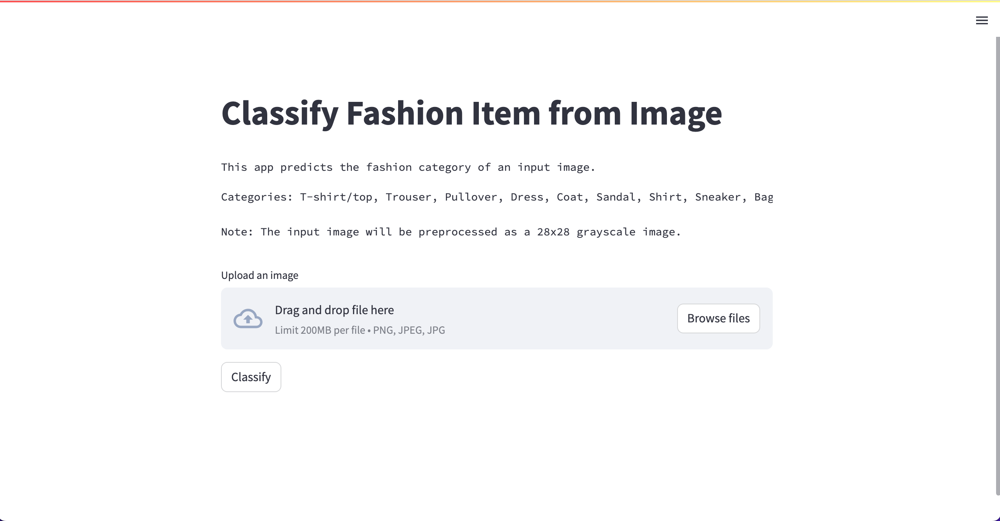
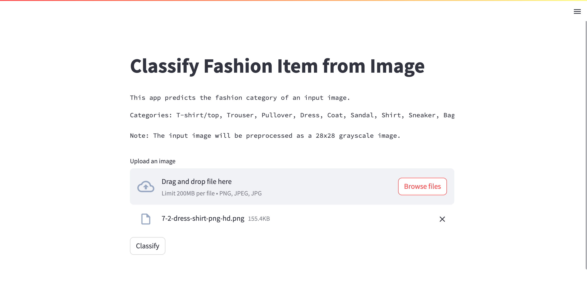
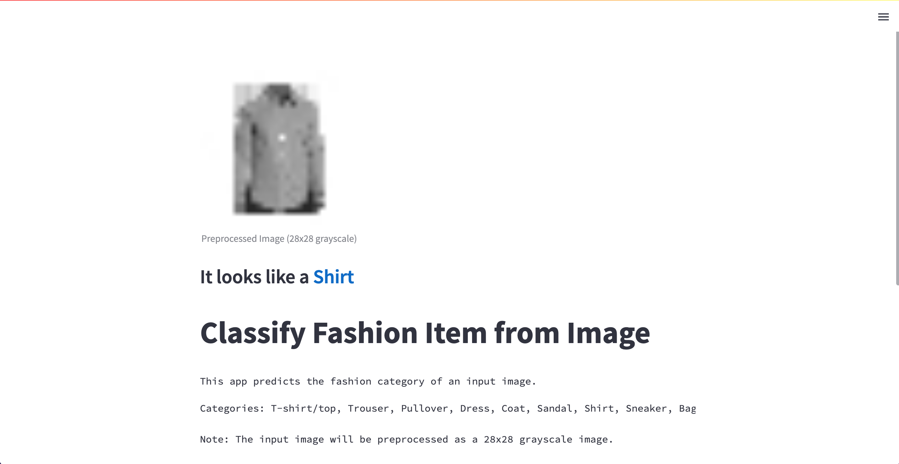
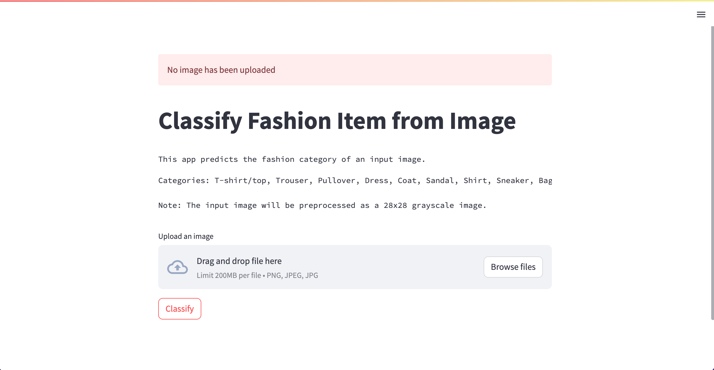

## AASD4015 - Advance Applied Mathematical Concepts for Deep Learning

# Mini Project 2 - Fashion Item Classification App

## Group 3:
* Thien An Trinh
* Roman Burekhin
* Athira Devan
* Lester Azinge

## Overview
This project is a simple Streamlit web application that classifies input images into fashion items. The app uses a pre-trained TensorFlow convolutional neural network (CNN) model to perform the classification. 

The output of the classification is one of the following fashion categories: `T-shirt/top`, `Trouser`, `Pullover`, `Dress`, `Coat`, `Sandal`, `Shirt`, `Sneaker`, `Bag`, `Ankle boot`.

## App usage
1. Click on this [link](link) to go to the app. It may take a while to initiate for the first time.

2. The app provides a brief description of its functionalites and the categories it can classify.  

3. Upload an image (PNG, JPEG, or JPG) to be classified using the **Browse files** button, or just drag and drop. You can use the image in the `sample image` folder in the [original repo](https://github.com/ThienAnTrinh/group3_miniproject2).

4. After the image has been uploaded, click the **Classify** button  

5. The model will generate the *preprocessed grayscale image* and the *predicted category* at the top of the screen.  

6. If no image has been uploaded, the app will show an error message.  

## Additional information
* Python version: 3.10
* SSL error on Mac: open a terminal and run `/Applications/Python\ 3.10/Install\ Certificates.command`
* The **load_and_convert** function loads an image, converts it to grayscale, and resizes it to a size of 28x28 pixels. This preprocessing step ensures compatibility with the trained model.
* The **predict** function performs the classification by feeding the preprocessed image to the model and extracting the predicted category. It displays the preprocessed image and the predicted category on the Streamlit app.

### Enjoy using the Fashion Item Classification App!
